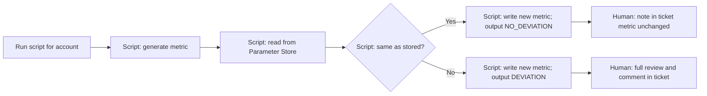

# AWS IAM Metric for Quarterly Attestation (AM-01-01)

## Goal

Turn the manual "review IAM users and credential report" ask into a **trackable metric** stored in **AWS Systems Manager Parameter Store**. A **single script** runs once per account: it computes the metric, compares it to the value in Parameter Store, and stores the new metric. If the metric is unchanged, no full review is needed; if it changed, trigger the full TGRC review.

## Metric definition

**Metric:** SHA256 hash of the sorted list of IAM user names (optional: plus IAM user count).

- Same set of users → same hash → no deviation.
- Any new or removed user → different hash → deviation → trigger full review and attach credential report.

## Storage: AWS Systems Manager Parameter Store only

All baseline and current metrics are stored in **Parameter Store** (no S3 or file-based baseline).

**Parameter naming convention:**

- **Previous (baseline) metric:**  
  `/qcr/AM-01-01/{account-id}/metric`  
  Value: JSON or plain string, e.g. `{"hash":"<sha256>","count":5,"updated":"2025-03-01"}` or just the hash.
- **Optional – last run result:**  
  `/qcr/AM-01-01/{account-id}/last_run`  
  Value: e.g. `{"hash":"...","count":5,"deviation":true|false,"timestamp":"..."}`.

Use **Standard** (not Advanced) parameters unless you need large values. The script will **read** the existing parameter (if present) for comparison and **write** the new metric after each run.

**IAM:** The role or user running the script needs at least:
- `ssm:GetParameter`, `ssm:PutParameter` (for the chosen parameter path prefix, e.g. `/qcr/AM-01-01/`).
- `iam:ListUsers` (and, when doing full review, `iam:GenerateCredentialReport`, `iam:GetCredentialReport`).

## Single-execution script (one run per account)

Develop a script (Bash or Python) that:

1. **Resolve account ID**  
   - From CLI default profile, or from `--account-id` / `--profile` argument.

2. **Generate current metric**  
   - Call `aws iam list-users` (e.g. `list-users --query 'Users[*].UserName' --output text`).  
   - Normalize (e.g. sort, one name per line), compute SHA256 of the sorted list.  
   - Optionally compute IAM user count.

3. **Read previous metric from Parameter Store**  
   - Get parameter: `/qcr/AM-01-01/{account-id}/metric`.  
   - If parameter does not exist, treat as "first run" (no previous baseline → consider it a deviation or no comparison).

4. **Compare**  
   - If current hash (and optionally count) equals stored value → **no deviation**.  
   - If different or no stored value → **deviation**.

5. **Output result**  
   - Print clearly: `DEVIATION` vs `NO_DEVIATION`, plus current hash (and count).  
   - Optionally print a one-line summary suitable for a ticket comment (e.g. "Metric unchanged; no IAM user set change" or "Metric changed; full review required").

6. **Store in Parameter Store**  
   - **Always** write the **current** metric to Parameter Store so this run becomes the baseline for the next run.  
   - Put parameter: `/qcr/AM-01-01/{account-id}/metric` with value containing current hash (and count, timestamp).  
   - Overwrite existing value (this run is the new baseline for next quarter).

**Single execution:** One invocation of the script = one account, one metric computation, one compare, one read from Parameter Store, one write to Parameter Store. No scheduling inside the script; scheduling (e.g. EventBridge or cron) can be added later if needed.

## Workflow (script + human)



- **Script:** Generate metric → read Parameter Store → compare → write current metric to Parameter Store → print DEVIATION or NO_DEVIATION.
- **Human:** If DEVIATION → do full attestation (credential report, justifications, approval tickets, comment). If NO_DEVIATION → optionally comment in ticket that metric was checked and unchanged.

## Script placement and interface

- **Place:** e.g. `scripts/qcr-iam-metric.sh` or `scripts/qcr_iam_metric.py` in the repo (or a dedicated "compliance" / "qcr" folder).
- **Usage (single execution per account):**  
  `./scripts/qcr-iam-metric.sh`  
  or  
  `./scripts/qcr-iam-metric.sh --account-id 123456789012`  
  or  
  `./scripts/qcr-iam-metric.sh --profile my-aws-profile`  
  so that one run = one account, one compare, one store.

## Credential report (only when deviation)

When the script reports **DEVIATION**, the reviewer generates the credential report separately (no change to script scope in this plan):

```bash
aws iam generate-credential-report
aws iam get-credential-report --output text --query Content | base64 -d > credential-report.csv
```

Attach to ticket and perform full review.

## Summary

- **Storage:** Metric and baseline stored **only** in **AWS Systems Manager Parameter Store** at `/qcr/AM-01-01/{account-id}/metric` (and optionally `last_run`).
- **Script:** One script, **single execution per account**, that: (1) generates IAM user metric (hash, optional count), (2) reads previous metric from Parameter Store, (3) compares and prints DEVIATION / NO_DEVIATION, (4) **writes current metric to Parameter Store** so the next run can compare against it.
- **No S3 or file baseline:** All compare-and-store logic uses Parameter Store only.
